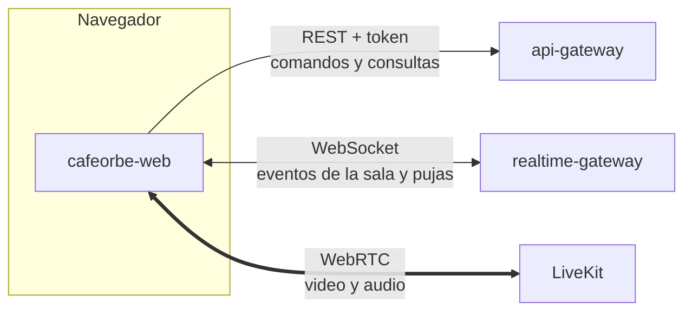
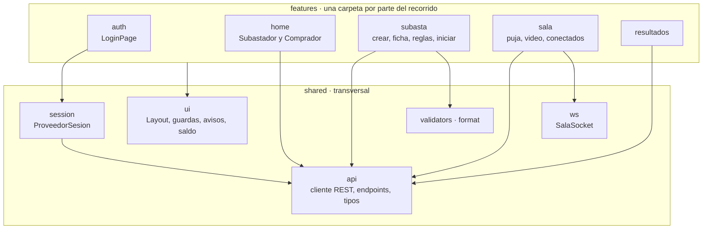
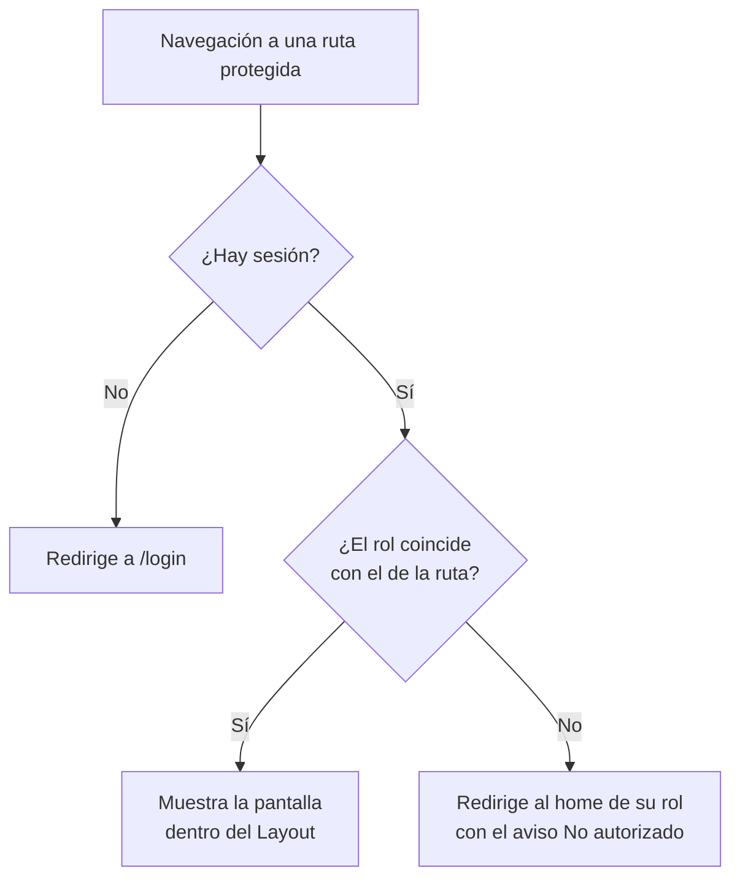
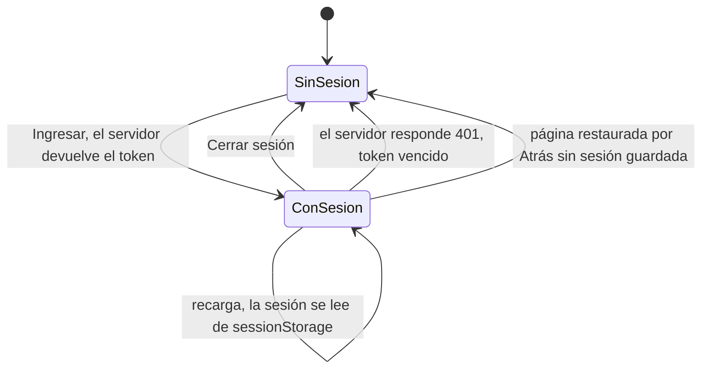
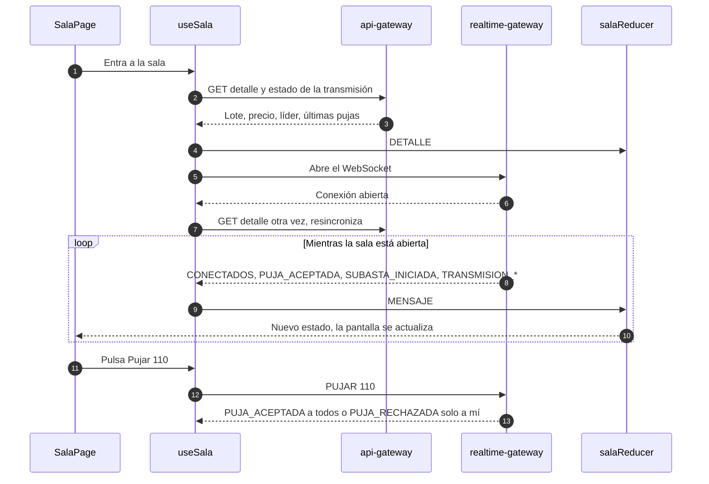
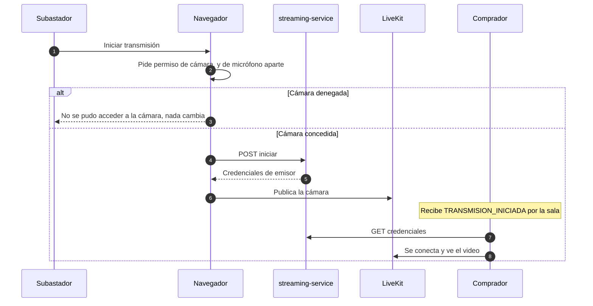
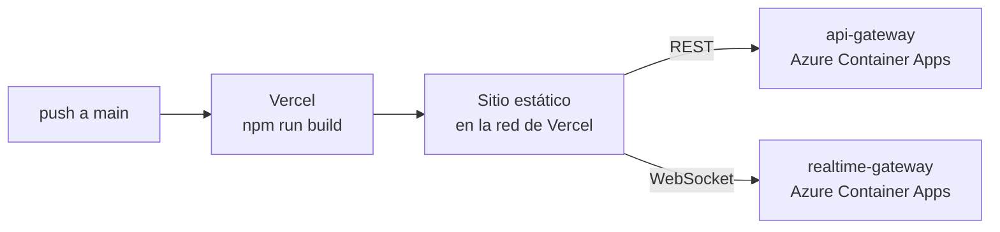

# cafeorbe-web

> Cliente web de CaféOrbe: una aplicación de una sola página donde el Subastador prepara y transmite su subasta y el Comprador entra a la sala y puja en vivo.

| | |
|---|---|
| **Responsabilidad** | Toda la interfaz: acceso, homes por rol, preparación de la subasta, sala en vivo y resultados |
| **Estilo interno** | SPA organizada por funcionalidades (feature-based) |
| **Stack** | React 19 · TypeScript 5.9 · Vite 8 · React Router 7 · LiveKit Client · Vitest |
| **Estado** | Sin librería de estado: contexto de React, un reducer para la sala y `sessionStorage` para la sesión |
| **Puerto en desarrollo** | `5173` |
| **Historias** | Capa de presentación de HU-01 a HU-14 |
| **Depende de** | api-gateway (REST), realtime-gateway (WebSocket) y LiveKit (video) |

## Contenido

1. [Contexto](#1-contexto)
2. [Arquitectura interna](#2-arquitectura-interna)
3. [Rutas y control de acceso](#3-rutas-y-control-de-acceso)
4. [Sesión](#4-sesión)
5. [La sala en vivo](#5-la-sala-en-vivo)
6. [Video](#6-video)
7. [Comunicación con el backend](#7-comunicación-con-el-backend)
8. [Decisiones de arquitectura](#8-decisiones-de-arquitectura)
9. [Atributos de calidad](#9-atributos-de-calidad)
10. [Configuración](#10-configuración)
11. [Ejecución y pruebas](#11-ejecución-y-pruebas)
12. [Despliegue](#12-despliegue)
13. [Riesgos conocidos y evolución](#13-riesgos-conocidos-y-evolución)

---

## 1. Contexto

El navegador habla con el backend por tres canales distintos, cada uno con un propósito.



| Canal | Para qué | Cliente en el código |
|---|---|---|
| REST | Ingresar, crear y configurar subastas, consultar detalle y saldo | `shared/api/client.ts` (único) |
| WebSocket | Recibir lo que pasa en la sala y enviar la puja | `shared/ws/salaSocket.ts` (único) |
| WebRTC | Emitir y ver el video | `features/sala/VideoLive.tsx` con `livekit-client` |

## 2. Arquitectura interna

El código se organiza por lo que el usuario hace, no por tipo de archivo. Cada carpeta de `features` es una parte del recorrido; `shared` contiene lo que usan varias.



| Carpeta | Contenido | Historias |
|---|---|---|
| `features/auth` | Pantalla de acceso con nombre y rol | HU-01 |
| `features/home` | Home del Subastador y del Comprador, aviso de carga de Orbes | HU-03, HU-04, HU-07 |
| `features/subasta` | Crear subasta, ficha del lote, reglas, botón Iniciar, Mis subastas | HU-08, HU-09, HU-10, HU-12 |
| `features/sala` | Sala en vivo: panel de puja, video, últimas pujas, conectados | HU-05, HU-06, HU-11, HU-13, HU-14 |
| `features/resultados` | Destino de una subasta finalizada (versión mínima; el resto es Sprint 2) | HU-05 |
| `shared` | Cliente REST, cliente WebSocket, sesión, guardas de ruta, componentes y validadores | HU-02 y transversal |

**Regla de dependencias:** las funcionalidades dependen de `shared`, nunca al revés. La lógica que se puede probar sin navegador vive en funciones puras (`salaReducer`, `botonPuja`, `validators`, `format`, `dispositivos`), separada de los componentes.

## 3. Rutas y control de acceso

| Ruta | Pantalla | Quién |
|---|---|---|
| `/login` | Acceso | Público |
| `/subastador` | Home del Subastador | Subastador |
| `/subastador/subastas` | Mis subastas | Subastador |
| `/subastador/subastas/nueva` | Crear subasta | Subastador |
| `/subastador/subastas/:id` | Preparación: ficha, reglas e inicio | Subastador |
| `/comprador` | Home del Comprador | Comprador |
| `/subastas/:id/sala` | Sala en vivo | Ambos |
| `/subastas/:id/resultados` | Resultados | Ambos |



Las guardas (`RequiereSesion`, `RequiereRol`) son una comodidad de la interfaz, **no la seguridad**: el backend vuelve a verificar rol y propiedad en cada petición.

## 4. Sesión



- El token y el usuario se guardan en `sessionStorage`: la sesión es **por pestaña** y se pierde al cerrarla.
- Cerrar sesión (HU-02) está en la barra superior de toda pantalla autenticada. Borra el almacenamiento y el estado; las guardas devuelven al acceso, así que **Atrás no reabre la sesión**.
- Caso particular cubierto: el navegador puede restaurar una página anterior tal como quedó en memoria (caché de avance y retroceso). Al restaurarse, la aplicación vuelve a comprobar la sesión guardada.
- Un `401` de cualquier petición cierra la sesión sola.

## 5. La sala en vivo

Es la pantalla más compleja: combina una carga inicial por REST con un flujo continuo de eventos por WebSocket.



| Pieza | Responsabilidad |
|---|---|
| `useSala` | Orquesta la carga por REST y el ciclo de vida del WebSocket |
| `salaReducer` | Función pura que aplica cada evento al estado de la sala |
| `SalaSocket` | Conexión con reconexión automática y espera creciente (hasta 10 s) y `PING` cada 25 s |
| `PanelPuja` + `botonPuja` | Precio, líder y el botón de puja rápida con sus estados |

**Tres reglas de diseño de la sala:**

1. **La pantalla no espera al WebSocket.** El detalle se carga por REST al entrar; si el canal en vivo no responde, igual se ve el lote con un aviso de reconexión.
2. **Cada reconexión resincroniza.** Al reabrirse el WebSocket se vuelve a pedir el detalle, así no se pierde ninguna puja ocurrida durante el corte.
3. **El resultado de mi puja llega como evento**, igual que las de los demás. El botón no asume que la puja fue aceptada.

**Estados del botón de puja rápida** (`botonPuja.ts`):

| Situación | Botón |
|---|---|
| Subasta en curso, no soy líder | `Pujar {precio actual + incremento}`, activo |
| Soy el líder | `Vas ganando`, deshabilitado |
| No tengo Orbes | `Orbes insuficientes`, deshabilitado |
| Ya pasó la hora de fin | `Tiempo agotado`, deshabilitado |
| La subasta aún no inicia | `La subasta aún no inicia`, deshabilitado |
| Sin conexión con la sala o esperando respuesta | Deshabilitado temporalmente |

## 6. Video



- El **permiso se pide antes** de avisar al servidor: si se niega, el indicador EN VIVO no cambia.
- El **micrófono es opcional**: sin él se transmite solo video, con un aviso.
- Al cerrar o recargar la pestaña se envía un aviso de detención que sobrevive al cierre (`keepalive`). Si tampoco llega, el servidor se entera por LiveKit.
- El SDK de video se descarga **solo al entrar a una sala** (carga diferida), para no penalizar el acceso y los homes.

## 7. Comunicación con el backend

Todas las llamadas REST pasan por una sola función (`peticion`), que agrega el token, interpreta el formato único de error del backend y cierra la sesión ante un `401`.

```json
{ "status": 400, "mensaje": "La fecha de inicio debe ser futura", "campos": { "fechaInicio": "La fecha de inicio debe ser futura" } }
```

- Si `campos` trae algo, el formulario muestra cada error **junto a su campo**; si no, lo muestra como error general.
- Los formularios validan antes de enviar con los **mismos mensajes** que el backend (`shared/validators.ts`), de modo que el usuario ve el mismo texto venga de donde venga.
- El saldo de Orbes se consulta al entrar, cada 8 segundos y después de cada puja. El componente de la barra lo comparte con el botón de puja.

## 8. Decisiones de arquitectura

| Decisión | Motivo | Costo aceptado |
|---|---|---|
| Organización por funcionalidades | Lo que cambia junto vive junto; una historia toca una carpeta | Hay que vigilar que `shared` no crezca sin criterio |
| Sin librería de estado global | El estado compartido es poco: sesión, avisos y saldo. Contexto y un reducer alcanzan | Si crece, habrá que introducir una |
| Reducer puro para la sala | Los eventos en vivo son la parte más propensa a errores: así se prueban sin navegador ni red | Una capa más entre el evento y la pantalla |
| Sesión en `sessionStorage` | Por pestaña: se puede abrir un Subastador y un Comprador a la vez para probar o hacer la demo | La sesión no sobrevive al cierre de la pestaña |
| Un solo cliente REST y un solo cliente WebSocket | Autenticación, errores y reconexión resueltos en un lugar | |
| Validación duplicada en cliente y servidor | Respuesta inmediata al usuario; el servidor sigue siendo la autoridad | Mensajes que mantener iguales en dos lugares |
| Carga diferida del SDK de video | Es la dependencia más pesada y solo se usa en la sala | Un instante de carga al entrar a la primera sala |
| CSS propio en un solo archivo, sin framework de componentes | Control total del diseño con pocas dependencias | Archivo grande; sin componentes prefabricados |

## 9. Atributos de calidad

| Atributo | Cómo se logra |
|---|---|
| **Tiempo real** | La pantalla refleja una puja ajena sin recargar, en torno a 200 ms |
| **Resiliencia** | Reconexión automática con resincronización; la sala carga aunque el canal en vivo falle |
| **Accesibilidad** | Enlace para saltar al contenido, regiones `aria-live` para precio y pujas, errores con `role="alert"`, respeto por la preferencia de movimiento reducido |
| **Adaptabilidad** | Diseño responsive y tema claro u oscuro según el sistema |
| **Mantenibilidad** | TypeScript estricto, sin variables ni parámetros sin usar |
| **Seguridad** | El token no viaja en URLs de REST; el backend es la autoridad sobre permisos |

## 10. Configuración

Variables de entorno de Vite, leídas en tiempo de compilación. En local no hace falta definirlas.

| Variable | Por defecto | Uso |
|---|---|---|
| `VITE_API_URL` | `http://localhost:8080` | api-gateway |
| `VITE_WS_URL` | `ws://localhost:8085` | realtime-gateway |

Para apuntar a otros servidores, copiar `.env.example` como `.env.local`.

## 11. Ejecución y pruebas

Requiere Node.js (probado con la versión 22) y el backend arriba (ver `cafeorbe-infra`).

```bash
npm install
npm run dev          # http://localhost:5173
npm test             # 35 pruebas
npm run build        # comprobación de tipos + build de producción
```

| Archivo de pruebas | Qué verifica |
|---|---|
| `shared/validators.test.ts` | Validaciones de acceso, crear subasta, ficha y reglas |
| `shared/format.test.ts` | Formato de Orbes, roles, estados y fechas |
| `features/sala/salaReducer.test.ts` | Efecto de cada evento de la sala sobre el estado |
| `features/sala/botonPuja.test.ts` | Estados del botón de puja rápida |
| `features/sala/dispositivos.test.ts` | Permisos de cámara y micrófono |

Las pruebas cubren la lógica pura. Los componentes y los flujos completos se verifican con el script `CafeOrbe_Contexto/verificacion/ui-sprint1.mjs`, que recorre las pantallas en un navegador sin interfaz contra el backend real.

## 12. Despliegue



El sitio se publica en Vercel. `VITE_API_URL` y `VITE_WS_URL` se configuran allí y quedan fijadas en el build. El backend solo acepta peticiones del origen del sitio publicado (`CORS_ORIGINS`).

`vercel.json` reescribe todas las rutas hacia `index.html`. Es necesario porque el enrutamiento ocurre en el navegador: sin esa regla, recargar o abrir directamente una ruta como `/comprador` responde `404`.

## 13. Riesgos conocidos y evolución

| Riesgo o deuda | Impacto | Acción propuesta |
|---|---|---|
| El repositorio no tiene pipeline de CI | Las pruebas no se ejecutan en cada cambio; Vercel solo compila | Flujo de GitHub Actions con `npm test` y `npm run build` |
| Sin pruebas de componentes | La interfaz se verifica con un script externo, no en el repositorio | Pruebas de componentes o de extremo a extremo dentro del repositorio |
| El token viaja en la URL del WebSocket | Puede quedar en registros de acceso | Token de un solo uso para abrir el canal |
| Saldo por consulta periódica | Hasta 8 s de retraso tras un cobro | Evento `orbes.cobrados` por la sala (Sprint 2) |
| Vistas previas de Vercel | Usan otro origen y el backend las rechaza por CORS | Lista de orígenes por ambiente |
| Un solo archivo de estilos | Difícil de mantener si la interfaz crece | Dividir por funcionalidad |

**Decisión a confirmar con el Product Owner (HU-13):** el criterio de la tarea pide deshabilitar el botón "si no hay saldo" y el escenario pide poder pulsarlo y ver `Orbes insuficientes`. Se implementaron ambos: con 0 Orbes se deshabilita; con saldo menor que el monto sigue activo y el rechazo lo da el servidor.

**Sprint 2:** reproductor y conteo para el Comprador (HU-15), temporizador en cuenta regresiva (HU-17), aviso de tiempo extendido (HU-18), transición al estado final (HU-19), anuncio del ganador (HU-21) y pantalla de resultados completa (HU-22, HU-23).
